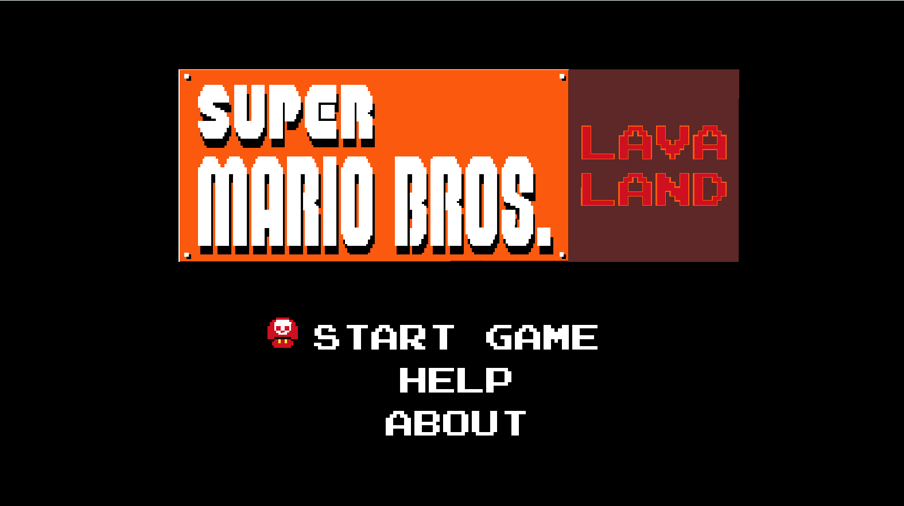
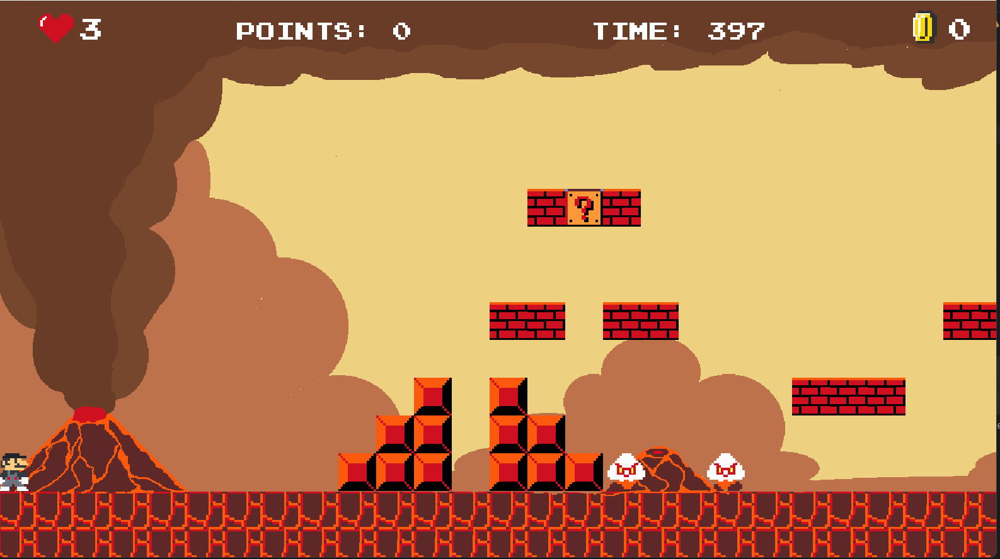
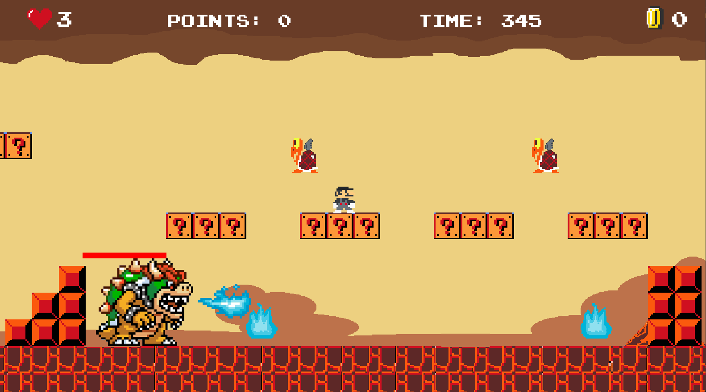
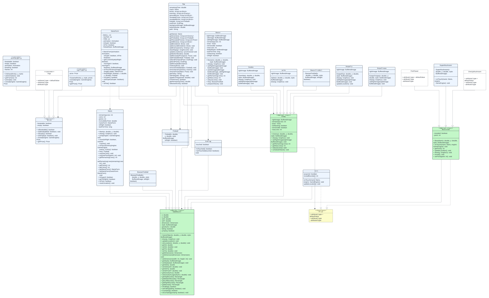

<!-- PROJECT LOGO -->
   

 

<!-- Welcome line -->

  Welcome to our repository  

<!-- TABLE OF CONTENTS -->
# Table of Contents
  <ol>
    <li>
      <a href="#Introduction">Introduction</a>
      <ul>
        <li><a href="#Team-members">Team Members</a></li>
	<li><a href="#installation">Installation</a></li>
	<li><a href="#motivation">Motivation</a></li>
	<li><a href="#task-allocation">Task Allocation</a></li>      
      </ul>
    </li>
    <li><a href="#Tool-Used">Tool Used</a></li>
    <li><a href="#features">Features</a></li>
    <li><a href="#challenges">Challenges</a></li>
    <li><a href="#acknowledgments">Acknowledgments</a></li>
    <li><a href="#references">References</a></li>
  </ol>

<!-- ABOUT THE PROJECT -->
# Introduction 

<!-- TEAM MEMBERS -->
## Team Members 

| Order |         Name          |     ID      |                  Email                  |                       Github account                        |                              Facebook                              |
| :---: | :-------------------: | :---------: |:---------------------------------------:| :---------------------------------------------------------: | :----------------------------------------------------------------: |
|   1   | Pham Nguyen Tien Dat | ITDSIU21080 |  ITDSIU21080@student.hcmiu.edu.vn | [datpham18903](https://github.com/datpham18903) | [Dat Pham ](https://www.facebook.com/pasmoi.pierre) |
|   2   | Trinh Binh Nguyen | ITDSIU21103 | ITDSIU21103@student.hcmiu.edu.vn | [NguyenTrinh3008](https://github.com/NguyenTrinh3008) | [Nguyên Trịnh ](https://www.facebook.com/profile.php?id=100014319038025) |
|   3   | Le Trung Kien | ITDSIU21093 |  ITDSIU21093@student.hcmiu.edu.vn | [KienGHPJ](https://github.com/KienGHPJ) | [Kien Trung Le ](https://www.facebook.com/ngo.khonghat.9) |
|   4   | Phan Nguyen Hung Cuong | ITDSIU21078 | ITDSIU21078@student.hcmiu.edu.vn | [HungCuong862003](https://github.com/HungCuong862003) | [Cuong Phan ](https://www.facebook.com/profile.php?id=100010564926274) |
|   5   | Duong Nhat Huy | ITDSIU21016 | ITDSIU21016@student.hcmiu.edu.vn | [duonghuy2003](https://github.com/duonghuy2003) | [Dương Nhật Huy ](https://www.facebook.com/profile.php?id=100013413992296) |

<!-- INSTALLATION -->
## Installation 
*Prerequisites*: Make sure that the following dependencies are installed on your machine:
-   Java 21
-  	Javafx
-  	Java AWT
-  	Javax.swing
-   Java 2D

<!-- MOTIVATION -->
## Motivation 
We are working with this game as our project lab of Object Oriented Programming is a 4-credit course. During our investigation into how to create 2D games with Java, we made the decision to enhance the Mario game, which was formerly quite well-known and familiar to many people.

<!-- TASK ALLOCATION -->
## Task Allocation 
| Order | Task                                  |  Person   | Contribution (%) |
| :---- |:--------------------------------------| :-------: | :----------: |
| 1     | Github repository host, file management, and redesign UI.  | Pham Nguyen Tien Dat  |      20      |
| 2     | Develop new mechanisms, new objects based on the original game, improved gameplay, and write README. | Trinh Binh Nguyen |      20      |
| 3     | Accompany with Nguyen to improve the game play, mechanism, and create UML. | Le Trung Kien |      20      |
| 4     | Fix bugs in the original game, accompany Kien to create UML, and write the report. | Phan Nguyen Hung Cuong |      20      |
| 5     | Make the sfx, accompany Dat to redesign the UI, and prepare powerpoint.  | Duong Nhat Huy |      20      |

<!-- TOOL USED -->
# Tool Used 
- Java 21 
- Javafx
- Paint
- Java 2D

<!-- FEATURES -->
# Features 
- About the rules to play
  - The objective of the game is to guide the player-controlled character, Mario, through challenges and adversaries to defeat his villain, Bowser.
  - The player has 3 lives to sustain throughout the entirety of the game.
  - Player uses the arrow keys to move Mario left or right and press the 'up' arrow key to make Mario jump.
  - There are three forms of Mario, players can utilize power-ups, such as mushrooms and flowers, by interacting with them during gameplay.
  - Overcome obstacles and beat the boss (if applicable) to reach the end of the level. When all lives are gone, the player will see a "Game Over" screen.
- General
  - START GAME: start the game
  - HELP: introduce instructions on how to play the game
  - ABOUT: introduce the authors and developers who made this game
- Design
  

- UML

<!-- CHALLENGES -->
# Challenges
- Interacting with Pre-existing Code: The established codebase was complex to comprehend and modify. At times, the rigidity of the classes and packages made the implementation of new features challenging.
- Difficulty Calibration: Striking an optimal balance to ensure the game is engaging yet not overly difficult for players was a demanding task.
- Employing JavaFX Framework: Our unfamiliarity with the JavaFX framework posed a challenge in leveraging it efficiently.

<!-- ACKNOWLEDGMENTS -->
# Acknowledgments
- We wish to express our profound appreciation to everyone who played a part in the successful completion of our OOP game project. This adventure has been immensely fulfilling, and the contributions of each team member have been indispensable.
- Our friends’ feedback and suggestions have been invaluable. Their perspectives have greatly enhanced the gaming experience. We extend our thanks to our beta testers who generously offered their time to aid us in perfecting our game. 
 [!IMPORTANT]
This project makes use of numerous open-source tools, OpenAI, and libraries. We express our deep gratitude to the developers and maintainers of these resources. Their contributions have been crucial in making our game a reality.

<!-- REFERENCES -->
# References
* https://github.com/ahmetcandiroglu/Super-Mario-Bros
* https://wallpapercave.com/w/wp7872568
* https://openjfx.io/#
* https://www.youtube.com/@gasparcoding
  

(<a href="#header">Back to top</a>)

